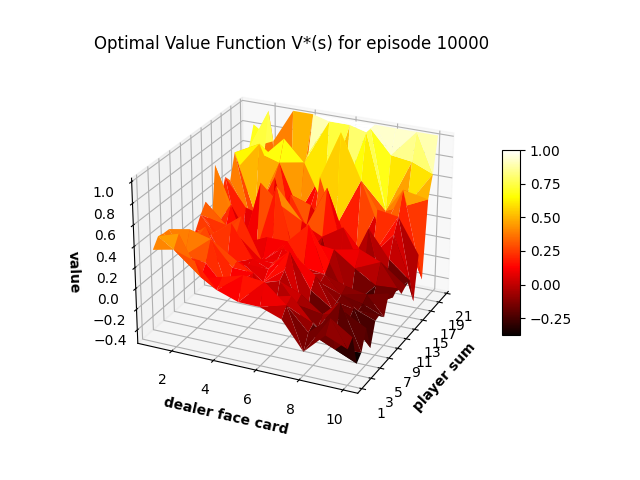
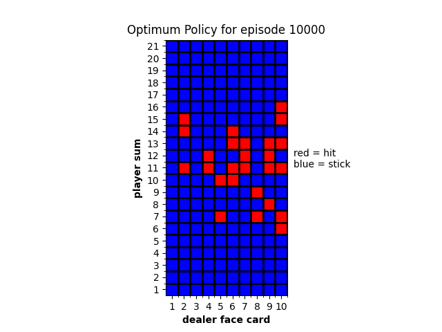
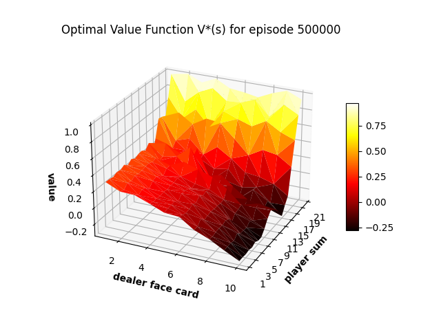
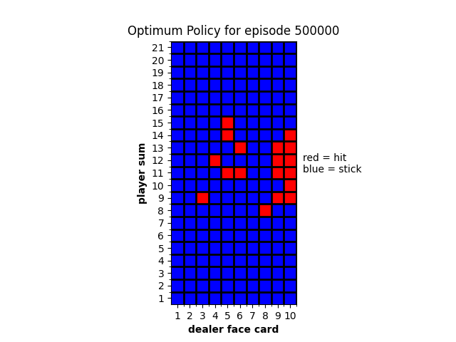
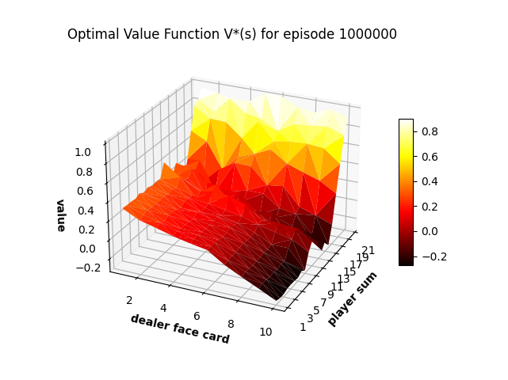
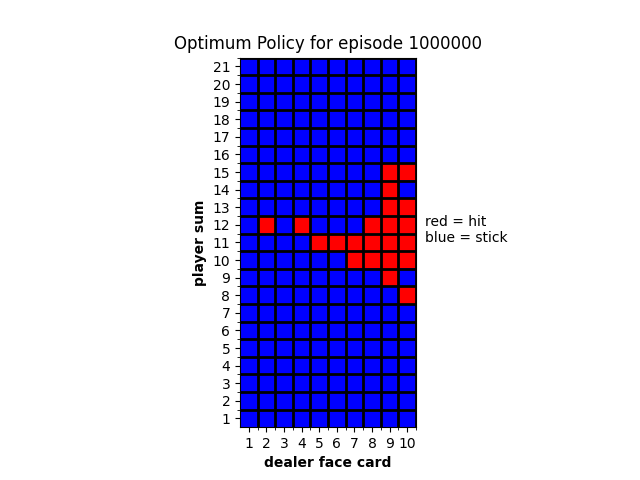

## Reinforcement Learning - Easy21

This repo contains python implementation to the card game problem from Dr. David Silver`s assignment called "Easy21".  
(:link: [Assignment Link](https://www.davidsilver.uk/wp-content/uploads/2020/03/Easy21-Johannes.pdf))  

This card game is "easy" in a sense that it simplify the rules from the Blackjack example in Sutto and Barto 5.3.  

The purpose is to find the optimal policy using various RL algorithms for this game.  

## Table of Contents
* [Rules](#rules)
* [RL algorithms](#rl-algorithms)
    * [Tabluar Monte Carlo Control](#tab-mc-control)

* [Setup](#setup)
* [Todos](#todos)
    * [Tabluar Sarsa(λ)](#tab-sarsa)
    * [Function approximation Sarsa(λ)](#func-sarsa)

## Rules
The rules are as follows,  
* The game is played with an infinite deck of cards (i.e. cards are sampled
with replacement)  

* Each draw from the deck results in a value between 1 and 10 (uniformly
distributed) with a colour of red (probability 1/3) or black (probability
2/3).  

* There are no aces or picture (face) cards in this game  

* At the start of the game both the player and the dealer draw one black
card (fully observed)  

* Each turn the player may either stick or hit  

* If the player hits then she draws another card from the deck  

* If the player sticks she receives no further cards  

* The values of the player’s cards are added (black cards) or subtracted (red
cards)  

* If the player’s sum exceeds 21, or becomes less than 1, then she “goes
bust” and loses the game (reward -1)  

* If the player sticks then the dealer starts taking turns. The dealer always
sticks on any sum of 17 or greater, and hits otherwise. If the dealer goes
bust, then the player wins; otherwise, the outcome – win (reward +1),
lose (reward -1), or draw (reward 0) – is the player with the largest sum.  

## RL algorithms
# Tabluar Monte Carlo Control
The implementation follows Dr. Silver`s note on Lecture 5 page 16. (:link: [GLIE Monte Carlo Control](https://www.davidsilver.uk/wp-content/uploads/2020/03/control.pdf))  

This version is more practical than the algorithm mentioned in Sutto and Barto page 101 in a sense that it introduces epsilon scheduling. Thus given sufficient time steps, epsilon will reaches 0 and eilson greedy policy will be optimal policy.  

In short, this implementation should be called `On-policy every-visit GLIE MC control (for epsilon greedy policy)`  

* Results - On-policy every-visit GLIE MC control

 
 
 

---
## Setup
1. Run easy21.py to perform RL
2. run plot.py to plot results
---
## Todos
# Tabluar Sarsa(λ)
To do.
# Function approximation Sarsa(λ)
To do.
